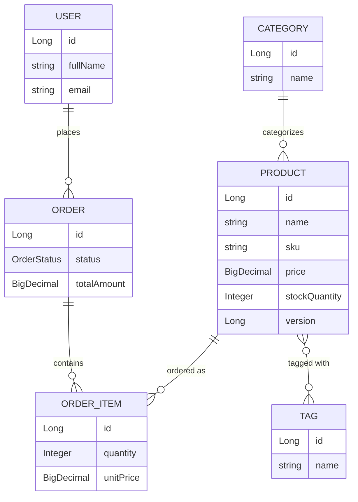

# E-Commerce / Inventory Management System

A REST API demonstrating clean layered architecture, JPA relationships, and
production-adjacent practices in Spring Boot. This is Project 1 of a 3-project
backend portfolio (Core REST API → Auth & Authorization → Production-grade
Booking/Order System).

**Status:** 🚧 Day 2 — domain model. Business logic, tests, and docs land over
the following days (see [Roadmap](#roadmap) below).

## Tech Stack

- Java 17
- Spring Boot 3.3.4 (Web, Data JPA, Validation, Actuator)
- PostgreSQL 16
- Docker Compose (local Postgres)
- JUnit 5 / Mockito / Testcontainers (from Day 9)
- Maven

## Prerequisites

- JDK 17+
- Maven 3.9+
- Docker + Docker Compose

## Running Locally

**1. Start Postgres:**

```bash
docker-compose up -d
```

This starts Postgres on host port **5433** (not the default 5432), so it
won't conflict with a Postgres instance you may already have running
locally. Container name: `ecommerce_postgres`, database: `ecommerce_db`.

**2. Run the app:**

```bash
mvn spring-boot:run
```

The app starts on `http://localhost:8080` using the `dev` profile
(`application-dev.yml`), which points at `localhost:5433`.

**3. Verify it's connected:**

```bash
curl http://localhost:8080/actuator/health
```

You should see `"status":"UP"` with a `db` component also reporting `UP`.

**4. Run tests:**

```bash
mvn test
```

> Tests currently require Postgres to be running (step 1) since there's no
> Testcontainers wiring yet — that lands on Day 10 and removes this
> dependency for the integration test suite.

**5. Stop Postgres:**

```bash
docker-compose down
```

Add `-v` to also drop the data volume: `docker-compose down -v`

## Domain Model



Relationship types covered: one-to-many (`User→Order`, `Order→OrderItem`,
`Category→Product`) and many-to-many (`Product↔Tag`).

## Configuration

| Variable | Where | Default |
|---|---|---|
| App port | `application-dev.yml` | `8080` |
| Postgres host port | `docker-compose.yml` | `5433` |
| DB name | `docker-compose.yml` | `ecommerce_db` |
| DB user / password | `docker-compose.yml` | `ecommerce_user` / `ecommerce_pass` |

## Roadmap

- [x] **Day 1** — Project bootstrap, Postgres via Docker Compose, health check
- [x] **Day 2** — Core JPA entities and relationships
- [ ] **Day 3** — Repositories and seed data
- [ ] **Day 4** — Product CRUD (Controller → Service → Repository, DTOs)
- [ ] **Day 5** — Validation and global exception handling
- [ ] **Day 6** — Order creation business logic
- [ ] **Day 7** — Custom queries, pagination, sorting
- [ ] **Day 8** — Dynamic filtering with JPA Specifications
- [ ] **Day 9** — Unit tests (JUnit5 + Mockito)
- [ ] **Day 10** — Integration tests (Testcontainers)
- [ ] **Day 11** — OpenAPI / Swagger docs
- [ ] **Day 12** — Edge cases and structured logging
- [ ] **Day 13** — Architecture diagram + full README
- [ ] **Day 14** — Refactor pass
- [ ] **Day 15** — Final polish, `v1.0` tag

## Design Decisions

- **Postgres on a non-default port (5433):** avoids clashing with a local
  Postgres install on the default 5432, without needing per-developer config
  overrides.
- **`ddl-auto: update` for now:** fine for early development; will be
  reconsidered (likely Flyway/Liquibase) as the schema stabilizes.
- **Actuator included from Day 1:** gives an immediate, honest way to verify
  DB connectivity rather than eyeballing console logs.
- **`BaseEntity` with id-only `equals`/`hashCode`:** shared across all
  entities via `@MappedSuperclass`. Basing equality only on `id` (via
  Lombok's `@EqualsAndHashCode.Include`) avoids two classic JPA foot-guns:
  pulling lazy-loaded relationship fields into equality checks, and infinite
  recursion on bidirectional relationships.
- **`OrderItem.unitPrice` is a snapshot, not a live read of `Product.price`:**
  if a product's price changes later, past orders should still reflect what
  the customer actually paid.
- **`Product.version` (optimistic locking) added now, used later:** costs
  nothing to add today and avoids a schema migration when Project 3 actually
  exercises it under concurrent stock updates.
- **`Order.addItem()`/`removeItem()` helper methods:** keep both sides of the
  bidirectional `Order ↔ OrderItem` relationship in sync in one place, rather
  than relying on every call site to remember to set both ends.
- **`Product ↔ Tag` many-to-many:** the one many-to-many relationship in the
  domain, kept deliberately simple (just a name) so the focus stays on the
  relationship mechanics rather than the domain concept.
