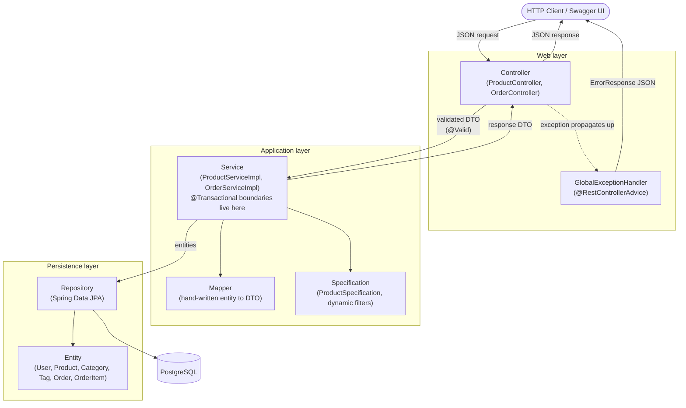
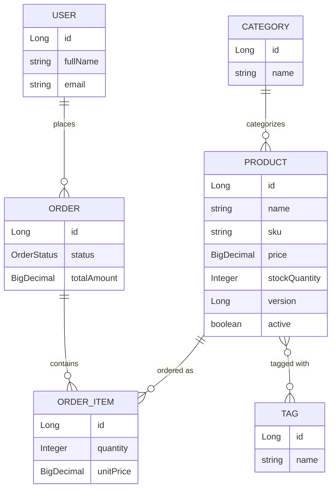

# E-Commerce / Inventory Management System

A REST API demonstrating clean layered architecture, JPA relationships, and
production-adjacent practices in Spring Boot. This is Project 1 of a 3-project
backend portfolio (Core REST API → Auth & Authorization → Production-grade
Booking/Order System).

**Status:** 🚧 Day 13 — README + architecture write-up (this file). See
[Architecture](#architecture) for the layered design and package layout,
and [Domain Model](#domain-model) for the entity-relationship diagram.
Once running, browse the full interactive API docs at
http://localhost:8080/swagger-ui.html. A refactor/cleanup pass and final
polish land over the following days (see [Roadmap](#roadmap) below). To
confirm the whole app works at this point, not just today's feature, run
the [Verification Checklist](#verification-checklist-run-this-to-confirm-the-whole-app-not-just-todays-feature).

## Tech Stack

- Java 17
- Spring Boot 3.3.4 (Web, Data JPA, Validation, Actuator)
- PostgreSQL 16
- Docker Compose (local Postgres)
- JUnit 5 / Mockito (service-layer unit tests) / Testcontainers (full-stack integration tests against real Postgres)
- springdoc-openapi (OpenAPI 3 + Swagger UI)
- Maven

## Prerequisites

- JDK 17+
- Maven 3.9+
- Docker + Docker Compose

## Running Locally

**1. Start Postgres:**

```bash
docker-compose up -d
```

This starts Postgres on host port **5433** (not the default 5432), so it
won't conflict with a Postgres instance you may already have running
locally. Container name: `ecommerce_postgres`, database: `ecommerce_db`.

**2. Run the app:**

```bash
mvn spring-boot:run
```

The app starts on `http://localhost:8080` using the `dev` profile
(`application-dev.yml`), which points at `localhost:5433`.

**3. Verify it's connected:**

```bash
curl http://localhost:8080/actuator/health
```

You should see `"status":"UP"` with a `db` component also reporting `UP`.

On first startup, `DevDataSeeder` populates a small dataset (2 categories, 3
tags, 4 products, 2 users, 2 orders) so there's something to query
immediately. It's idempotent - it checks for existing data first, so
restarting the app won't duplicate rows.

**Peek at the seeded data (optional):**

```bash
docker exec -it ecommerce_postgres psql -U ecommerce_user -d ecommerce_db -c "SELECT name, sku, price, stock_quantity FROM products;"
```

**4. Run tests:**

```bash
mvn test
```

> Tests currently require Postgres to be running (step 1) since there's no
> Testcontainers wiring yet — that lands on Day 10 and removes this
> dependency for the integration test suite.

**5. Stop Postgres:**

```bash
docker-compose down
```

Add `-v` to also drop the data volume: `docker-compose down -v`

## Architecture

Strict layering, one direction only - a layer talks to the one directly
below it, never sideways into another layer's internals, and never back up:



- **Controllers are deliberately thin** - request/response translation and
  HTTP status codes only. See `ProductController`'s class-level Javadoc.
  Every business rule (category/tag resolution, stock decrement, state
  transitions) lives in the service layer, which is what makes it
  unit-testable with Mockito (Day 9) without a running web server.
- **DTOs are the only thing that crosses the Controller boundary in either
  direction** - entities are never serialized directly to JSON or bound
  directly from a request body. See the Design Decisions entry on this
  below for why.
- **Exceptions flow up, not down** - a service throws a plain exception
  (`ResourceNotFoundException`, `InsufficientStockException`, etc.) and has
  no awareness of HTTP at all; `GlobalExceptionHandler` is the only place
  that translates an exception into a status code and an `ErrorResponse`
  body. That's also the single place error logging happens (Day 12) - see
  its own Design Decisions entry for why that's centralized there instead
  of scattered through the services.
- **`@Transactional` boundaries live in the service layer**, not the
  controller or repository - see `OrderServiceImpl`'s class-level Javadoc
  for what that buys `create()` when an item partway through an order fails
  (Day 10's integration tests prove this rolls back for real, against
  Postgres, not just in a mock).

### Package layout

```
com.portfolio.ecommerce
├── controller/      Thin HTTP layer - one class per resource
├── service/          Business logic, interface + impl per resource
│   └── impl/
├── repository/       Spring Data JPA interfaces
├── domain/            JPA entities
│   └── enums/
├── dto/               Request/response shapes, one subpackage per resource
│   ├── common/         Shared wrappers (PageResponse)
│   ├── product/
│   └── order/
├── mapper/            Hand-written entity <-> DTO mapping
├── specification/     Dynamic JPA Specification filters (Day 8)
├── exception/         Custom exceptions + GlobalExceptionHandler
├── validation/        Custom Bean Validation constraints (@ValidSku)
├── config/             @Configuration classes (JPA auditing, OpenAPI)
└── seed/               Dev-profile CommandLineRunner seed data
```

## Domain Model



Relationship types covered: one-to-many (`User→Order`, `Order→OrderItem`,
`Category→Product`) and many-to-many (`Product↔Tag`).

## API

📖 **Full interactive API docs (once the app is running):** http://localhost:8080/swagger-ui.html
(raw OpenAPI 3 spec at http://localhost:8080/v3/api-docs). Every endpoint
below - request/response schemas, example values, and every documented
error response - is generated live from the code, not hand-maintained, so
it can't drift out of sync with what's actually deployed. The tables below
are a quick-reference summary for browsing this README; Swagger UI is the
source of truth.

Product CRUD is live end-to-end (Controller → Service → Repository, DTOs
only - the `Product` entity is never returned or accepted directly).

### Products

| Method | Path | Description |
|---|---|---|
| `POST` | `/api/products` | Create a product |
| `GET` | `/api/products` | List products (paginated) |
| `GET` | `/api/products/{id}` | Get one product |
| `GET` | `/api/products/search` | Dynamic, combinable filtering (name, category, price range, in-stock), paginated |
| `GET` | `/api/products/low-stock` | Products at or below a stock threshold |
| `PUT` | `/api/products/{id}` | Replace a product |
| `DELETE` | `/api/products/{id}` | Delete a product |
| `POST` | `/api/products/{id}/discontinue` | Mark a product unavailable for new orders (Day 12) |
| `POST` | `/api/products/{id}/reactivate` | Reverse `/discontinue` (Day 12) |

Requests are validated with Bean Validation, and every error - validation
failure, missing resource, malformed JSON, or anything unexpected - comes
back in the same shape via a global `@RestControllerAdvice`:

```json
{
  "timestamp": "2026-09-12T10:15:30.123Z",
  "status": 400,
  "error": "Bad Request",
  "message": "Validation failed",
  "path": "/api/products",
  "fieldErrors": {
    "price": "Price must be greater than zero",
    "sku": "SKU must contain only uppercase letters, digits, and single hyphens (e.g. ELEC-LAPTOP-001)"
  }
}
```

**Try it** (category id `1` is "Electronics" from the seed data):

```bash
curl -X POST http://localhost:8080/api/products \
  -H "Content-Type: application/json" \
  -d '{
        "name": "Mechanical Keyboard",
        "description": "Hot-swappable, 75% layout",
        "sku": "ELEC-KEYBOARD-001",
        "price": 129.00,
        "stockQuantity": 30,
        "categoryId": 1,
        "tagIds": []
      }'
```

```bash
curl http://localhost:8080/api/products
curl http://localhost:8080/api/products/1
```

`GET /api/products` is paginated - `page`, `size`, and `sort` are all query
params handled automatically by Spring Data (`sort` accepts
`field,direction`, e.g. `sort=price,desc`):

```bash
curl "http://localhost:8080/api/products?page=0&size=2&sort=price,desc"
```

```json
{
  "content": [ { "id": 1, "name": "14-inch Laptop", "price": 999.99, "...": "..." } ],
  "pageNumber": 0,
  "pageSize": 2,
  "totalElements": 5,
  "totalPages": 3,
  "last": false
}
```

**Dynamic filtering** - any subset of `name`, `categoryId`, `minPrice`,
`maxPrice`, `inStock` can be combined; omitted params simply aren't applied:

```bash
# electronics between $50-$500 that are in stock, cheapest first
curl "http://localhost:8080/api/products/search?categoryId=1&minPrice=50&maxPrice=500&inStock=true&sort=price,asc"

# case-insensitive name search on its own
curl "http://localhost:8080/api/products/search?name=laptop"
```

Low-stock products (default threshold `10`, override with `?threshold=`):

```bash
curl "http://localhost:8080/api/products/low-stock?threshold=30"
```

**See the error handling in action:**

```bash
# unknown product id -> 404
curl http://localhost:8080/api/products/999

# invalid payload -> 400 with fieldErrors
curl -X POST http://localhost:8080/api/products \
  -H "Content-Type: application/json" \
  -d '{"name": "", "sku": "bad sku!", "price": -5, "stockQuantity": -1, "categoryId": null}'
```

### Orders

| Method | Path | Description |
|---|---|---|
| `POST` | `/api/orders` | Place an order (decrements stock) |
| `GET` | `/api/orders` | List orders (paginated) |
| `GET` | `/api/orders/{id}` | Get one order |
| `GET` | `/api/orders/by-user/{email}` | An account's orders, paginated, newest first |
| `GET` | `/api/orders/search` | Orders for an email within a date range |
| `POST` | `/api/orders/{id}/confirm` | PENDING → CONFIRMED |
| `POST` | `/api/orders/{id}/cancel` | → CANCELLED, restocks items |

Placing an order resolves each `productId`, checks stock, decrements it, and
snapshots the current price into `unitPrice` on each line item - the whole
operation is one transaction, so a stock failure on item 3 of 5 rolls back
the decrements already made for items 1 and 2.

**Try it** (user id `1` is Alice, product id `1` is the seeded laptop):

```bash
curl -X POST http://localhost:8080/api/orders \
  -H "Content-Type: application/json" \
  -d '{
        "userId": 1,
        "items": [
          {"productId": 1, "quantity": 1},
          {"productId": 3, "quantity": 2}
        ]
      }'
```

```bash
curl http://localhost:8080/api/orders/1
curl -X POST http://localhost:8080/api/orders/1/confirm
curl -X POST http://localhost:8080/api/orders/1/cancel   # restocks both line items
```

Ordering more than the available stock returns a `409 Conflict`:

```bash
curl -i -X POST http://localhost:8080/api/orders \
  -H "Content-Type: application/json" \
  -d '{"userId": 1, "items": [{"productId": 1, "quantity": 9999}]}'
```

A user's order history, paginated, newest first:

```bash
curl "http://localhost:8080/api/orders/by-user/alice@example.com?page=0&size=5"
```

Orders for a user within a date range (ISO-8601 timestamps):

```bash
curl "http://localhost:8080/api/orders/search?email=alice@example.com&from=2026-01-01T00:00:00Z&to=2026-12-31T23:59:59Z"
```

Discontinuing a product, then trying to order it:

```bash
curl -X POST http://localhost:8080/api/products/1/discontinue
curl -i -X POST http://localhost:8080/api/orders \
  -H "Content-Type: application/json" \
  -d '{"userId": 1, "items": [{"productId": 1, "quantity": 1}]}'
# -> 409 Conflict: "Product 'Laptop' (sku: ELEC-LAPTOP-001) has been discontinued and can't be ordered"
```

## Edge Cases

Day 12 walks through four specific failure modes end-to-end - each one has
a passing automated test (unit and/or integration, listed below) and a
`curl` example in this README, not just a mention here.

| Edge case | How it's handled | Tested by |
|---|---|---|
| **Ordering a discontinued product** | `Product.active` (default `true`) is set to `false` via `POST /products/{id}/discontinue`. `OrderServiceImpl.create()` checks this *before* the stock check, for every item, and throws `ProductNotAvailableException` -> `409` if any item's product isn't active. | `OrderServiceImplTest.throwsWhenProductIsDiscontinued`, `OrderIntegrationTest.orderingDiscontinuedProductReturnsConflict`, `ProductServiceImplTest.DiscontinueReactivate`, `ProductIntegrationTest.discontinueThenReactivate` |
| **Negative order quantity** | Already rejected by Bean Validation (`@Positive` on `OrderItemRequestDto.quantity`, cascaded via `@Valid` on the list) - this never reaches the service layer at all. Day 12 adds the test that actually proves it, over real HTTP. | `OrderIntegrationTest.negativeQuantityReturnsValidationError` |
| **Non-existent user** | `OrderServiceImpl.create()` looks up the user first, before touching any product, and throws `ResourceNotFoundException` -> `404`. Already covered since Day 9/10; listed here for completeness. | `OrderServiceImplTest.throwsWhenUserNotFound`, `OrderIntegrationTest.createOrderWithUnknownUserReturnsNotFound` |
| **Concurrent stock decrement** | `Product.version` (`@Version`, added Day 2) makes Hibernate detect it when two requests read the same product row and both try to commit a change. `GlobalExceptionHandler` now turns that into a clean `409` instead of a raw `500`. **This is explicitly a stopgap, not a fix** - see the Design Decisions entry below for what's actually missing and why the real fix is out of scope for this project. | `GlobalExceptionHandlerTest.handlesOptimisticLockConflict` (verifies the mapping deterministically; see that test's Javadoc for why an actual concurrent-write reproduction isn't attempted here) |
| **Duplicate SKU** *(found during the Day 14/15 review, not Day 12)* | There's no service-layer pre-check on `Product.sku` - a pre-check-then-insert has its own race condition under concurrent requests, so the DB's `unique` constraint is the actual source of truth. `GlobalExceptionHandler` catches `DataIntegrityViolationException` and maps it to a clean `409` instead of a raw `500` with a leaked SQL/constraint-name detail. | `GlobalExceptionHandlerTest.handlesDataIntegrityViolation`, `ProductIntegrationTest.createWithDuplicateSkuReturnsConflict` |

### Structured logging

Every service-layer state change and every handled exception now logs
through SLF4J (`@Slf4j`), at a level matching who's responsible:

- **`INFO`** - business events worth an audit trail: product created/
  updated/deleted/discontinued/reactivated, order created/confirmed/
  cancelled.
- **`WARN`** - expected, client-caused outcomes: every 4xx response
  (`GlobalExceptionHandler`, one line per handled exception type, with the
  HTTP method/path/message), plus a dedicated low-stock warning logged the
  moment an order's stock decrement leaves a product at or below 5 units.
- **`ERROR`** - only the catch-all "unexpected exception" handler, with the
  full stack trace, since that's the one case where something actually
  went wrong on the server's side rather than a normal rejected request.

`application-dev.yml` already sets `com.portfolio.ecommerce: debug` (from
Day 1), so all of the above are visible by default when running locally.

```bash
curl -X POST http://localhost:8080/api/orders \
  -H "Content-Type: application/json" \
  -d '{"userId": 1, "items": [{"productId": 2, "quantity": 2}]}'
# check the app's console output for lines like:
#   INFO ... Order created: orderId=3, userId=1, itemCount=1, totalAmount=50.00
#   WARN ... Low stock after order: productId=2, sku=ELEC-MOUSE-001, remainingStock=1
```

## Verification Checklist (run this to confirm the whole app, not just today's feature)

This section is cumulative and updated every day - it's meant to prove the
*entire* app works end-to-end at its current state, not just whatever
landed most recently. Run top to bottom after starting Postgres and the app
(see [Running Locally](#running-locally)); every step includes what a
correct result looks like so a failure is obvious.

**0. Preconditions**

```bash
docker-compose up -d
mvn spring-boot:run &      # or run it in its own terminal
sleep 5
curl http://localhost:8080/actuator/health
```
Expect: `{"status":"UP", ...}` with a `db` component also `UP`. If this
fails, nothing below will work - check `docker-compose ps` first.

**1. Seed data is present** (2 categories, 3 tags, 4 products, 2 users, 2 orders)

```bash
curl -s http://localhost:8080/api/products | python3 -m json.tool | grep totalElements
```
Expect: `"totalElements": 4` (before you add anything below).

**2. Product CRUD** (Day 4/5)

```bash
# create -> 201 with Location header and a body containing the new id
curl -i -X POST http://localhost:8080/api/products \
  -H "Content-Type: application/json" \
  -d '{"name":"Mechanical Keyboard","sku":"ELEC-KEYBOARD-001","price":129.00,"stockQuantity":30,"categoryId":1,"tagIds":[]}'

# read it back by id -> 200, same data
curl http://localhost:8080/api/products/5

# validation failure -> 400 with fieldErrors (Day 5)
curl -i -X POST http://localhost:8080/api/products \
  -H "Content-Type: application/json" \
  -d '{"name":"","sku":"bad sku!","price":-5,"stockQuantity":-1,"categoryId":null}'

# not found -> 404
curl -i http://localhost:8080/api/products/999

# update -> 200 with changed fields
curl -i -X PUT http://localhost:8080/api/products/5 \
  -H "Content-Type: application/json" \
  -d '{"name":"Mechanical Keyboard v2","sku":"ELEC-KEYBOARD-001","price":139.00,"stockQuantity":25,"categoryId":1,"tagIds":[]}'

# delete -> 204, then a re-read -> 404
curl -i -X DELETE http://localhost:8080/api/products/5
curl -i http://localhost:8080/api/products/5
```

**3. Pagination and sorting** (Day 7)

```bash
curl -s "http://localhost:8080/api/products?page=0&size=2&sort=price,desc" | python3 -m json.tool
```
Expect: `content` has 2 items, ordered by price descending; `pageSize: 2`.

**4. Low-stock query** (Day 7)

```bash
curl -s "http://localhost:8080/api/products/low-stock?threshold=30" | python3 -m json.tool
```
Expect: only products with `stockQuantity <= 30`, ordered ascending by stock.

**5. Dynamic filtering / Specifications** (Day 8)

```bash
# combined filters
curl -s "http://localhost:8080/api/products/search?categoryId=1&minPrice=50&maxPrice=500&inStock=true" | python3 -m json.tool

# name filter alone
curl -s "http://localhost:8080/api/products/search?name=laptop" | python3 -m json.tool

# no filters at all -> behaves like plain GET /api/products
curl -s "http://localhost:8080/api/products/search" | python3 -m json.tool
```
Expect: each call returns only products matching the supplied filters;
omitted filters don't narrow the result at all; the no-filter call returns
everything (paginated).

**6. Order creation, stock decrement, transactional rollback** (Day 6)

```bash
# happy path -> 201, totalAmount computed, stock decremented on the products used
curl -i -X POST http://localhost:8080/api/orders \
  -H "Content-Type: application/json" \
  -d '{"userId":1,"items":[{"productId":1,"quantity":1},{"productId":3,"quantity":2}]}'

# insufficient stock -> 409, and confirm nothing was partially decremented
curl -i -X POST http://localhost:8080/api/orders \
  -H "Content-Type: application/json" \
  -d '{"userId":1,"items":[{"productId":1,"quantity":9999}]}'
curl http://localhost:8080/api/products/1   # stockQuantity unchanged by the failed attempt
```

**7. Order state transitions** (Day 6)

```bash
curl -i -X POST http://localhost:8080/api/orders/3/confirm   # PENDING -> CONFIRMED, 200
curl -i -X POST http://localhost:8080/api/orders/3/cancel    # -> CANCELLED, 200, restocks items
curl -i -X POST http://localhost:8080/api/orders/3/cancel    # already cancelled -> 409
```

**8. Order queries** (Day 7)

```bash
curl -s "http://localhost:8080/api/orders/by-user/alice@example.com?page=0&size=5" | python3 -m json.tool
curl -s "http://localhost:8080/api/orders/search?email=alice@example.com&from=2026-01-01T00:00:00Z&to=2026-12-31T23:59:59Z" | python3 -m json.tool
```
Expect: only Alice's orders, newest first for #8's first call; only orders
inside the date range for the second.

**9. Automated tests** (Day 9 unit tests + Day 10 integration tests + Day 12 additions)

```bash
mvn test
```
Requires a running Docker daemon (Testcontainers pulls and starts its own
disposable `postgres:16-alpine` container automatically - you do **not**
need `docker-compose up -d` for this step; that's only for running the app
itself). Expect: `Tests run: <N>, Failures: 0, Errors: 0` and `BUILD SUCCESS`.

Unit tests (mocked repositories, no database):

- `ProductServiceImplTest` - see Day 9 in the Roadmap for the original
  list; Day 12 adds a `DiscontinueReactivate` nested class covering both
  actions' happy paths and not-found cases.
- `OrderServiceImplTest` - see Day 9 in the Roadmap for the original list;
  Day 12 adds `throwsWhenProductIsDiscontinued`, asserting the discontinued
  check runs *before* the stock check and that stock is left untouched.
- `SkuFormatValidatorTest` (Day 9, unchanged).
- `GlobalExceptionHandlerTest` (new, Day 12) - calls every handler method
  directly with a mocked `HttpServletRequest`, deterministically covering
  all seven exception-to-HTTP-status mappings, including the two Day 12
  additions (`ProductNotAvailableException` -> 409,
  `ObjectOptimisticLockingFailureException` -> 409 with a safe generic
  message rather than Hibernate's raw one). See its Javadoc for why this is
  a plain unit test rather than an attempt to reproduce a real concurrent
  write.

Integration tests (real Spring context, real MockMvc HTTP dispatch through
the actual controllers, real Postgres via Testcontainers):

- `EcommerceInventorySystemApplicationTests` - the original Day-1 context-load
  smoke test, now running against Testcontainers instead of a manually
  started docker-compose stack.
- `ProductIntegrationTest` - full CRUD lifecycle (create -> read -> update ->
  delete -> re-read returns 404, with each step also verified directly
  against `ProductRepository`, not just the HTTP response), the validation
  error response shape over real HTTP (`fieldErrors` keyed by field, one
  entry per violation), an unknown `categoryId` returning 404 rather than
  400 or 500, and (Day 12) a discontinue -> reactivate lifecycle verified
  against the real DB after each step.
- `OrderIntegrationTest` - order creation with stock really decremented in
  Postgres, insufficient stock returning 409 with stock left untouched, an
  unknown user returning 404, the confirm/cancel state machine restoring
  stock for real on cancel, and (Day 12) ordering a discontinued product
  returning 409 with stock untouched, plus a negative quantity returning
  400 before ever reaching the service layer. The one test this whole
  suite exists for: when an order has two items and the *second* one fails
  its stock check, the *first* item's already-decremented stock is
  asserted to be back to its original value afterward - proving the
  `@Transactional` order-creation method really rolls back everything it
  did, against a real database. Day 9's mocked-repository test could only
  prove the exception was thrown and `save()` was never called; it had no
  real transaction to roll back and so could never make this specific
  claim.

All of the above run in the same `mvn test` invocation - JUnit doesn't
distinguish "unit" from "integration" here by naming convention alone, it's
by which base class each test extends (`AbstractIntegrationTest` and its
Testcontainers/`@Transactional` setup, or nothing at all).

**10. API documentation** (Day 11)

```bash
curl -s http://localhost:8080/v3/api-docs | python3 -m json.tool | head -20
```
Expect a valid OpenAPI 3 JSON document (`"openapi": "3.x.x"`, an `info`
block with this project's title/description, and a `paths` object listing
every endpoint under `/api/products/**` and `/api/orders/**`).

Then open **http://localhost:8080/swagger-ui.html** in a browser and check:
- Two tags, **Products** and **Orders**, each with its description
- Every endpoint has a summary and, for anything beyond a plain 200/201,
  a documented set of alternate response codes (400/404/409) with an
  `ErrorResponse` schema and example
- "Try it out" on `POST /api/products` and `POST /api/orders` shows a
  pre-filled example request body (from the `@Schema(example = ...)`
  annotations on the DTOs) rather than an empty or all-null template

**11. Edge cases and logging** (Day 12 - see [Edge Cases](#edge-cases) above for the full table)

```bash
# discontinue product 1, then try to order it -> 409, stock untouched
curl -X POST http://localhost:8080/api/products/1/discontinue
curl -i -X POST http://localhost:8080/api/orders \
  -H "Content-Type: application/json" \
  -d '{"userId": 1, "items": [{"productId": 1, "quantity": 1}]}'
curl -X POST http://localhost:8080/api/products/1/reactivate   # put it back for later steps

# negative quantity -> 400 with fieldErrors, never reaches the service layer
curl -i -X POST http://localhost:8080/api/orders \
  -H "Content-Type: application/json" \
  -d '{"userId": 1, "items": [{"productId": 1, "quantity": -1}]}'
```
While these run, watch the app's console output: the discontinued-product
attempt should log a `WARN` line from `GlobalExceptionHandler` (`409 on
POST /api/orders: ...discontinued...`), and a successful order that leaves
a product at 5 units or fewer should log a `WARN` low-stock line from
`OrderServiceImpl`. Also confirm `mvn test` (step 9) now additionally
passes `GlobalExceptionHandlerTest`, which deterministically covers every
handler branch including the two new ones from today.

---

## Configuration

| Variable | Where | Default |
|---|---|---|
| App port | `application-dev.yml` | `8080` |
| Postgres host port | `docker-compose.yml` | `5433` |
| DB name | `docker-compose.yml` | `ecommerce_db` |
| DB user / password | `docker-compose.yml` | `ecommerce_user` / `ecommerce_pass` |

## Roadmap

- [x] **Day 1** — Project bootstrap, Postgres via Docker Compose, health check
- [x] **Day 2** — Core JPA entities and relationships
- [x] **Day 3** — Repositories and seed data
- [x] **Day 4** — Product CRUD (Controller → Service → Repository, DTOs)
- [x] **Day 5** — Validation and global exception handling
- [x] **Day 6** — Order creation business logic
- [x] **Day 7** — Custom queries, pagination, sorting
- [x] **Day 8** — Dynamic filtering with JPA Specifications
- [x] **Day 9** — Unit tests (JUnit5 + Mockito)
- [x] **Day 10** — Integration tests (Testcontainers)
- [x] **Day 11** — OpenAPI / Swagger docs
- [x] **Day 12** — Edge cases and structured logging
- [x] **Day 13** — Architecture diagram + full README
- [x] **Day 14** — Refactor pass
- [x] **Day 15** — Final polish, `v1.0` tag

## Design Decisions

*The three entries below are the ones the roadmap named explicitly for Day
13; everything after them accumulated day-by-day as each feature landed,
oldest first.*

- **Why DTOs, and never the JPA entities directly, cross the Controller
  boundary:** an entity's shape is driven by the database and JPA (lazy
  collections, bidirectional relationships that would recurse infinitely
  under naive Jackson serialization, the `@Version` field, cascading
  `OrderItem`s). A client shouldn't see any of that, and shouldn't be able
  to set fields like `version` or `id` on a create request. DTOs also let
  the request and response shapes for the same resource differ on purpose -
  `ProductRequestDto` has no `id`/`createdAt`/`categoryName` because those
  aren't the client's to set, while `ProductResponseDto` has no `tagIds`
  because the client needs the resolved tag *names*, not IDs it would have
  to look up again. Coupling the API contract to the persistence model
  would mean a schema change (or even a lazy-loading strategy change)
  becomes a breaking API change.
- **Why `Specification` over QueryDSL for dynamic filtering (Day 8):**
  QueryDSL needs an annotation processor generating Q-classes at build
  time, an extra Maven plugin, and a generated-sources directory to keep
  out of version control - real cost for a project this size, where the
  filtering need is five independent, optional, AND-combinable predicates
  on one entity. `Specification` ships in Spring Data JPA already, composes
  the same way (`.and(...)`), and the "no build step" trade-off only starts
  to hurt on filters complex enough to need QueryDSL's stronger typing or
  joins-as-first-class-objects - `ProductSpecification` isn't there. See
  Day 8's dedicated Design Decisions entry (below) for the null-predicate
  composition trick this relies on.
- **Why these specific relationships (`User 1—* Order`, `Order 1—* OrderItem`,
  `OrderItem *—1 Product`, `Product *—1 Category`, `Product *—* Tag`):**
  each cardinality follows directly from a real constraint, not convention
  for its own sake. `Order 1—* OrderItem` (not a direct `Order *—* Product`)
  exists specifically so `OrderItem.unitPrice` can snapshot the price *at
  order time* - collapsing it to a many-to-many would lose that snapshot
  and let a later price change silently rewrite historical order totals.
  `Product *—1 Category` (not many-to-many) reflects that this catalog
  needs exactly one category per product for filtering/reporting; `Tag` is
  many-to-many because tags are explicitly non-exclusive labels layered on
  top of that one category. `User 1—* Order` and `Order 1—* OrderItem` are
  both cascaded with orphan removal from the parent (see `Order.addItem`/
  `removeItem` in the entity itself) so an order's line items can never
  exist without their order.
- **`discontinue`/`reactivate` are dedicated action endpoints, not a field
  on the create/update DTO:** `ProductRequestDto` already models full PUT
  replace semantics for everything else, and folding `active` into that
  would make every client sending a `PUT` responsible for remembering and
  re-sending the product's current active status just to avoid
  accidentally flipping it back on. This mirrors the shape Orders already
  uses for `/confirm` and `/cancel` - a state transition is a distinct
  action, not an incidental side effect of replacing a resource.
- **Optimistic-lock handling is explicitly a stopgap, documented as such in
  three places (the exception handler's Javadoc, the `Product.version`
  field's Javadoc, and the Edge Cases table above):** mapping
  `ObjectOptimisticLockingFailureException` to a clean `409` stops a client
  from seeing a raw `500` and a Hibernate stack trace, but it does nothing
  to make the *losing* request in a race actually succeed - the customer
  whose request lost the race just gets told to retry manually. A
  production-grade fix needs either a retry-with-backoff loop around the
  stock decrement or a pessimistic lock on the product row for the
  duration of the check-then-decrement, and deciding between those two
  (and load-testing the result) is real enough work that it's explicitly
  Project 3's problem, not something to half-do here under Day 12's
  "note it" scope.
- **Error logging lives in `GlobalExceptionHandler`, not scattered across
  try/catch blocks in each service method:** every request that ends in an
  exception passes through the handler exactly once, regardless of which
  service or which method threw it, so putting the logging there gives
  complete coverage (one log line per failed request, correctly leveled by
  status code) without duplicating logging code in `ProductServiceImpl`
  and `OrderServiceImpl` for every exception they can throw. Business
  events that *aren't* errors (order created, product discontinued) still
  get logged at their actual source in the service layer, since
  `GlobalExceptionHandler` never sees a successful call.
- **The low-stock log threshold (`5`, in `OrderServiceImpl`) is a separate
  constant from `ProductService.getLowStock(int threshold)`'s caller-
  supplied query parameter, despite the similar name:** one is an
  operational signal ("warn when a decrement leaves a product this low")
  that fires automatically and doesn't need to be configurable per request;
  the other is a deliberate query a caller runs on demand with whatever
  threshold makes sense for them right now. Conflating them would mean
  either the log noise level changes based on what some client happened to
  query for, or the query's threshold gets silently capped by a constant
  meant for something else.

- **springdoc-openapi pinned to the explicit `2.6.0` version, not left to
  the parent POM:** every other dependency in `pom.xml` relies on
  `spring-boot-starter-parent`'s version management, but springdoc's 3.x
  line targets Spring Boot 4, which this project isn't on. Leaving the
  version off here (the pattern used everywhere else) would either fail to
  resolve or silently pull in an incompatible major version depending on
  how the BOM resolves it - explicit is safer than consistent, in this one
  case.
- **Error responses (`@ApiResponses` for 400/404/409) are hand-written on
  each controller method, not inferred:** springdoc generates the 2xx
  response from the method's return type automatically, but it has no way
  to see that `ProductServiceImpl.getById(...)` can throw
  `ResourceNotFoundException` - that exception is thrown several layers
  below the controller and only becomes an HTTP 404 in
  `GlobalExceptionHandler`, which springdoc doesn't trace through. Writing
  these by hand is what makes Swagger UI's documented response codes match
  what the API can actually return, instead of just showing the happy path.
- **`@ParameterObject` on `Pageable` and `ProductSearchCriteria` instead of
  leaving them undocumented:** without it, springdoc has no visibility into
  a multi-field query-param object's individual fields, so `page`/`size`/
  `sort` and the five search filters would show up as one opaque,
  unexpandable parameter in Swagger UI instead of one documented field each.

- **Testcontainers over H2 for integration tests:** H2 is fast and needs no
  Docker, but it isn't Postgres - different dialect quirks, different
  constraint-violation behavior, different handling of things like the
  `@Version` optimistic-locking column this project already has on
  `Product`. A green test suite against H2 can still hide a bug that only
  shows up against real Postgres. Testcontainers costs a Docker daemon and
  a few extra seconds of container startup; in exchange, "the tests pass"
  and "the app works against Postgres" become the same claim.
- **One `static` Postgres container shared by every integration test class
  (`AbstractIntegrationTest`), not one per class:** Testcontainers calls
  this the singleton container pattern. Starting a fresh container per test
  class would multiply total suite runtime for no real isolation benefit,
  since `@Transactional` (below) already gives each *test method* a clean
  slate without needing a clean *container*.
- **`@Transactional` on the integration test base class for per-test
  rollback, instead of manual cleanup or `@Sql` scripts:** Spring's test
  support wraps each test method in a transaction and rolls it back when the
  method finishes, and a service method's own `@Transactional` simply joins
  that surrounding transaction rather than opening a second one. That gives
  every test a clean database with zero hand-written teardown code - and
  it's also why the rollback assertions in `OrderIntegrationTest` are
  trustworthy: the same transactional join behavior that cleans up after
  the test is what makes "does the whole order-creation method really roll
  back on a mid-loop failure" a question real Postgres can answer, not just
  a mock.
- **`ProductIntegrationTest` and `OrderIntegrationTest` re-query the
  repository directly after each MockMvc call, instead of trusting the HTTP
  response alone:** the HTTP response only proves the controller *said* the
  right thing. Re-reading `stockQuantity` from `ProductRepository` after an
  order request proves the database actually has the right thing, which is
  the entire reason Day 10 exists rather than just writing more Day-9-style
  unit tests.
- **Constructed services with `new ProductServiceImpl(...)` in test `setUp()`
  instead of `@InjectMocks`:** both work here since the constructor is a
  simple `@RequiredArgsConstructor` over the mocked fields, but being
  explicit means a future field reorder or an added constructor param fails
  loudly at compile time instead of silently leaving a mock unwired.
- **`search()`'s unit test asserts `findAll(any(Specification.class), eq(pageable))`
  rather than inspecting the Specification's predicate:** a `Specification`
  is a lambda; there's no clean way to assert "this lambda filters by name"
  without actually running it against data, which is what
  `ProductSpecification.fromCriteria(...)`'s own correctness depends on
  Hibernate to evaluate. Asserting *that a Specification was passed through
  to the repository* is the right-sized claim for a mocked-repository unit
  test; whether the generated SQL actually filters correctly is verified for
  real once Day 10's Testcontainers suite runs it against Postgres.
- **Insufficient-stock rollback is asserted differently at the unit vs.
  integration level:** `OrderServiceImplTest` can only prove "the exception
  is thrown and `save()` is never called" - with mocked repositories there's
  no real transaction, so there's nothing to actually roll back. Whether an
  in-progress stock decrement on an *earlier* item in the same request
  really reverts in the database when a *later* item fails is a claim only
  a real transactional test against real Postgres can make - that's what
  Day 10 adds.
- **Postgres on a non-default port (5433):** avoids clashing with a local
  Postgres install on the default 5432, without needing per-developer config
  overrides.
- **`ddl-auto: update` for now:** fine for early development; will be
  reconsidered (likely Flyway/Liquibase) as the schema stabilizes.
- **Actuator included from Day 1:** gives an immediate, honest way to verify
  DB connectivity rather than eyeballing console logs.
- **`BaseEntity` with id-only `equals`/`hashCode`:** shared across all
  entities via `@MappedSuperclass`. Basing equality only on `id` (via
  Lombok's `@EqualsAndHashCode.Include`) avoids two classic JPA foot-guns:
  pulling lazy-loaded relationship fields into equality checks, and infinite
  recursion on bidirectional relationships.
- **`OrderItem.unitPrice` is a snapshot, not a live read of `Product.price`:**
  if a product's price changes later, past orders should still reflect what
  the customer actually paid.
- **`Product.version` (optimistic locking) added now, used later:** costs
  nothing to add today and avoids a schema migration when Project 3 actually
  exercises it under concurrent stock updates.
- **`Order.addItem()`/`removeItem()` helper methods:** keep both sides of the
  bidirectional `Order ↔ OrderItem` relationship in sync in one place, rather
  than relying on every call site to remember to set both ends.
- **`Product ↔ Tag` many-to-many:** the one many-to-many relationship in the
  domain, kept deliberately simple (just a name) so the focus stays on the
  relationship mechanics rather than the domain concept.
- **`DevDataSeeder` guarded by profile + row count:** using a
  `CommandLineRunner` instead of `data.sql` because it exercises the actual
  entity relationships (via `Order.addItem()`) rather than hand-written
  insert statements that could drift from the schema. Restricted to the
  `dev` profile and made idempotent so it's safe to leave running.
- **Hand-written `ProductMapper` over MapStruct/ModelMapper:** the
  entity↔DTO mapping is simple enough that a generated mapper wouldn't save
  much, and an explicit mapper keeps the boundary readable in one place.
- **Service returns DTOs, never entities:** `ProductService` methods return
  `ProductResponseDto`, not `Product`. The controller never touches the
  entity at all, which is what actually enforces "don't leak JPA entities
  over the wire" rather than just conventionally avoiding it.
- **`ResourceNotFoundException` introduced before its handler:** the service
  layer's contract (throw when something's missing) was written correctly
  from Day 4, even though the `@ControllerAdvice` that turns it into a 404
  didn't land until Day 5.
- **Custom `@ValidSku` validator instead of a bare `@Pattern`:** a
  `@Pattern`-only approach would give a generic "must match regex" message
  when it fails. A custom `ConstraintValidator` lets the error message
  explain the actual convention (uppercase, digits, hyphens) instead - the
  kind of thing that matters when this is the message a teammate sees.
  It also deliberately treats blank values as valid, leaving "is it present
  at all" to `@NotBlank`, so the two annotations report distinct problems
  instead of one confusing combined one.
- **One `GlobalExceptionHandler`, one `ErrorResponse` shape:** every error
  path - validation failure, missing resource, malformed JSON, unexpected
  exception - returns the same JSON shape. A client only needs to learn one
  error format, and `fieldErrors` is omitted from the JSON entirely (via
  `@JsonInclude(NON_NULL)`) when there isn't any, rather than showing up as
  `null`.
- **Unexpected exceptions are logged server-side before being masked from
  the client:** the `Exception.class` fallback handler logs the full stack
  trace but returns a generic "unexpected error" message - enough detail to
  debug from the logs, without leaking internals to the API consumer.
- **`OrderService.create()` is one transaction covering every line item:**
  stock is decremented per item as the loop runs, using plain setters on
  managed entities rather than explicit `save()` calls (JPA's dirty checking
  flushes them at commit). If any item fails - unknown product, insufficient
  stock - the whole transaction rolls back, including stock already
  decremented for earlier items in the same request. Partial orders aren't a
  safe thing to expose as an API.
- **`InsufficientStockException` / `InvalidOrderStateException` → 409, not
  400 or 404:** both describe a well-formed request that can't be satisfied
  right now (not enough stock; wrong order status for this transition) -
  semantically a conflict with current state, distinct from bad input or a
  missing resource.
- **`cancel()` restocks; `confirm()` doesn't touch stock:** cancelling an
  order releases the inventory it reserved, so it's allowed from `PENDING`
  or `CONFIRMED` but not from `CANCELLED` again (would double-restock).
  Confirming is a pure status transition since stock was already reserved
  at order creation time.
- **`PageResponse<T>` instead of returning `Page<T>` directly:** Spring
  Data's own docs warn against serializing `PageImpl` as-is - it isn't
  designed as a stable wire format. Wrapping it keeps the JSON shape
  (`content`, `pageNumber`, `pageSize`, `totalElements`, `totalPages`,
  `last`) something this project controls.
- **`SELECT DISTINCT` on the order date-range query:** fetch-joining a
  collection (`o.items`) returns one row per (order, item) pair, so without
  `DISTINCT` an order with 3 items would show up 3 times in the result list.
  This only affects collection fetch joins - the `ManyToOne` fetch join in
  `findLowStock` doesn't have the problem, since a to-one join can't
  multiply rows.
- **`ProductSpecification` methods return a `null` predicate when their own
  filter is absent, instead of branching in the service layer:** Spring
  Data's `Specification.and(...)` composition treats a `null` predicate as
  a no-op and drops it from the final query. That's what makes the filters
  genuinely combinable - `/products/search` with zero params degrades to
  "match everything," and any subset of `name`/`categoryId`/`minPrice`/
  `maxPrice`/`inStock` combines without an `if` per filter or a combinatorial
  explosion of hand-written queries.
- **`@Query` used where a derived method name would get awkward:** simple
  lookups (`findByEmail`, `findBySku`) stay as derived queries - they're
  clearer as method names than as JPQL. The date-range order query and the
  low-stock product query switch to `@Query` because they need fetch joins
  and ordering control that a method name can't express cleanly.
