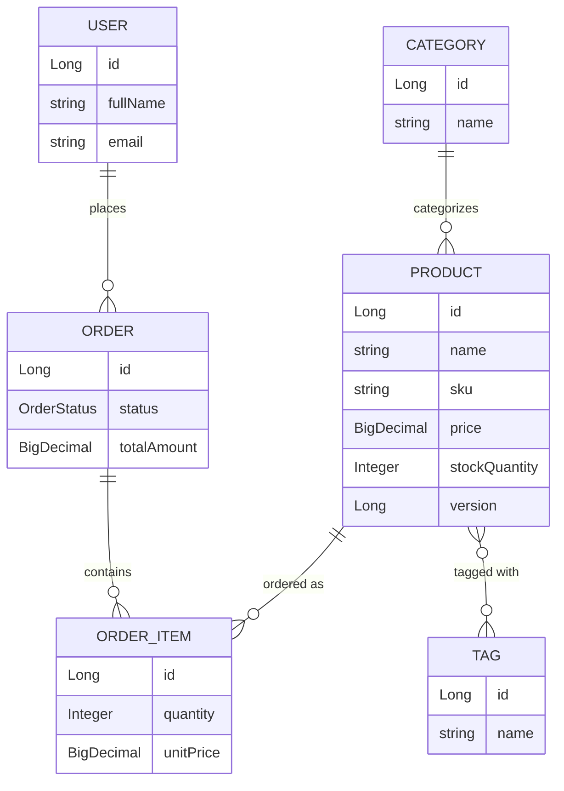

# E-Commerce / Inventory Management System

A REST API demonstrating clean layered architecture, JPA relationships, and
production-adjacent practices in Spring Boot. This is Project 1 of a 3-project
backend portfolio (Core REST API → Auth & Authorization → Production-grade
Booking/Order System).

**Status:** 🚧 Day 6 — order creation business logic. Custom queries,
filtering, tests, and docs land over the following days (see
[Roadmap](#roadmap) below).

## Tech Stack

- Java 17
- Spring Boot 3.3.4 (Web, Data JPA, Validation, Actuator)
- PostgreSQL 16
- Docker Compose (local Postgres)
- JUnit 5 / Mockito / Testcontainers (from Day 9)
- Maven

## Prerequisites

- JDK 17+
- Maven 3.9+
- Docker + Docker Compose

## Running Locally

**1. Start Postgres:**

```bash
docker-compose up -d
```

This starts Postgres on host port **5433** (not the default 5432), so it
won't conflict with a Postgres instance you may already have running
locally. Container name: `ecommerce_postgres`, database: `ecommerce_db`.

**2. Run the app:**

```bash
mvn spring-boot:run
```

The app starts on `http://localhost:8080` using the `dev` profile
(`application-dev.yml`), which points at `localhost:5433`.

**3. Verify it's connected:**

```bash
curl http://localhost:8080/actuator/health
```

You should see `"status":"UP"` with a `db` component also reporting `UP`.

On first startup, `DevDataSeeder` populates a small dataset (2 categories, 3
tags, 4 products, 2 users, 2 orders) so there's something to query
immediately. It's idempotent - it checks for existing data first, so
restarting the app won't duplicate rows.

**Peek at the seeded data (optional):**

```bash
docker exec -it ecommerce_postgres psql -U ecommerce_user -d ecommerce_db -c "SELECT name, sku, price, stock_quantity FROM products;"
```

**4. Run tests:**

```bash
mvn test
```

> Tests currently require Postgres to be running (step 1) since there's no
> Testcontainers wiring yet — that lands on Day 10 and removes this
> dependency for the integration test suite.

**5. Stop Postgres:**

```bash
docker-compose down
```

Add `-v` to also drop the data volume: `docker-compose down -v`

## Domain Model



Relationship types covered: one-to-many (`User→Order`, `Order→OrderItem`,
`Category→Product`) and many-to-many (`Product↔Tag`).

## API

Product CRUD is live end-to-end (Controller → Service → Repository, DTOs
only - the `Product` entity is never returned or accepted directly).

### Products

| Method | Path | Description |
|---|---|---|
| `POST` | `/api/products` | Create a product |
| `GET` | `/api/products` | List all products |
| `GET` | `/api/products/{id}` | Get one product |
| `PUT` | `/api/products/{id}` | Replace a product |
| `DELETE` | `/api/products/{id}` | Delete a product |

Requests are validated with Bean Validation, and every error - validation
failure, missing resource, malformed JSON, or anything unexpected - comes
back in the same shape via a global `@RestControllerAdvice`:

```json
{
  "timestamp": "2026-09-12T10:15:30.123Z",
  "status": 400,
  "error": "Bad Request",
  "message": "Validation failed",
  "path": "/api/products",
  "fieldErrors": {
    "price": "Price must be greater than zero",
    "sku": "SKU must contain only uppercase letters, digits, and single hyphens (e.g. ELEC-LAPTOP-001)"
  }
}
```

**Try it** (category id `1` is "Electronics" from the seed data):

```bash
curl -X POST http://localhost:8080/api/products \
  -H "Content-Type: application/json" \
  -d '{
        "name": "Mechanical Keyboard",
        "description": "Hot-swappable, 75% layout",
        "sku": "ELEC-KEYBOARD-001",
        "price": 129.00,
        "stockQuantity": 30,
        "categoryId": 1,
        "tagIds": []
      }'
```

```bash
curl http://localhost:8080/api/products
curl http://localhost:8080/api/products/1
```

**See the error handling in action:**

```bash
# unknown product id -> 404
curl http://localhost:8080/api/products/999

# invalid payload -> 400 with fieldErrors
curl -X POST http://localhost:8080/api/products \
  -H "Content-Type: application/json" \
  -d '{"name": "", "sku": "bad sku!", "price": -5, "stockQuantity": -1, "categoryId": null}'
```

### Orders

| Method | Path | Description |
|---|---|---|
| `POST` | `/api/orders` | Place an order (decrements stock) |
| `GET` | `/api/orders` | List all orders |
| `GET` | `/api/orders/{id}` | Get one order |
| `POST` | `/api/orders/{id}/confirm` | PENDING → CONFIRMED |
| `POST` | `/api/orders/{id}/cancel` | → CANCELLED, restocks items |

Placing an order resolves each `productId`, checks stock, decrements it, and
snapshots the current price into `unitPrice` on each line item - the whole
operation is one transaction, so a stock failure on item 3 of 5 rolls back
the decrements already made for items 1 and 2.

**Try it** (user id `1` is Alice, product id `1` is the seeded laptop):

```bash
curl -X POST http://localhost:8080/api/orders \
  -H "Content-Type: application/json" \
  -d '{
        "userId": 1,
        "items": [
          {"productId": 1, "quantity": 1},
          {"productId": 3, "quantity": 2}
        ]
      }'
```

```bash
curl http://localhost:8080/api/orders/1
curl -X POST http://localhost:8080/api/orders/1/confirm
curl -X POST http://localhost:8080/api/orders/1/cancel   # restocks both line items
```

Ordering more than the available stock returns a `409 Conflict`:

```bash
curl -i -X POST http://localhost:8080/api/orders \
  -H "Content-Type: application/json" \
  -d '{"userId": 1, "items": [{"productId": 1, "quantity": 9999}]}'
```

## Configuration

| Variable | Where | Default |
|---|---|---|
| App port | `application-dev.yml` | `8080` |
| Postgres host port | `docker-compose.yml` | `5433` |
| DB name | `docker-compose.yml` | `ecommerce_db` |
| DB user / password | `docker-compose.yml` | `ecommerce_user` / `ecommerce_pass` |

## Roadmap

- [x] **Day 1** — Project bootstrap, Postgres via Docker Compose, health check
- [x] **Day 2** — Core JPA entities and relationships
- [x] **Day 3** — Repositories and seed data
- [x] **Day 4** — Product CRUD (Controller → Service → Repository, DTOs)
- [x] **Day 5** — Validation and global exception handling
- [x] **Day 6** — Order creation business logic
- [ ] **Day 7** — Custom queries, pagination, sorting
- [ ] **Day 8** — Dynamic filtering with JPA Specifications
- [ ] **Day 9** — Unit tests (JUnit5 + Mockito)
- [ ] **Day 10** — Integration tests (Testcontainers)
- [ ] **Day 11** — OpenAPI / Swagger docs
- [ ] **Day 12** — Edge cases and structured logging
- [ ] **Day 13** — Architecture diagram + full README
- [ ] **Day 14** — Refactor pass
- [ ] **Day 15** — Final polish, `v1.0` tag

## Design Decisions

- **Postgres on a non-default port (5433):** avoids clashing with a local
  Postgres install on the default 5432, without needing per-developer config
  overrides.
- **`ddl-auto: update` for now:** fine for early development; will be
  reconsidered (likely Flyway/Liquibase) as the schema stabilizes.
- **Actuator included from Day 1:** gives an immediate, honest way to verify
  DB connectivity rather than eyeballing console logs.
- **`BaseEntity` with id-only `equals`/`hashCode`:** shared across all
  entities via `@MappedSuperclass`. Basing equality only on `id` (via
  Lombok's `@EqualsAndHashCode.Include`) avoids two classic JPA foot-guns:
  pulling lazy-loaded relationship fields into equality checks, and infinite
  recursion on bidirectional relationships.
- **`OrderItem.unitPrice` is a snapshot, not a live read of `Product.price`:**
  if a product's price changes later, past orders should still reflect what
  the customer actually paid.
- **`Product.version` (optimistic locking) added now, used later:** costs
  nothing to add today and avoids a schema migration when Project 3 actually
  exercises it under concurrent stock updates.
- **`Order.addItem()`/`removeItem()` helper methods:** keep both sides of the
  bidirectional `Order ↔ OrderItem` relationship in sync in one place, rather
  than relying on every call site to remember to set both ends.
- **`Product ↔ Tag` many-to-many:** the one many-to-many relationship in the
  domain, kept deliberately simple (just a name) so the focus stays on the
  relationship mechanics rather than the domain concept.
- **`DevDataSeeder` guarded by profile + row count:** using a
  `CommandLineRunner` instead of `data.sql` because it exercises the actual
  entity relationships (via `Order.addItem()`) rather than hand-written
  insert statements that could drift from the schema. Restricted to the
  `dev` profile and made idempotent so it's safe to leave running.
- **Hand-written `ProductMapper` over MapStruct/ModelMapper:** the
  entity↔DTO mapping is simple enough that a generated mapper wouldn't save
  much, and an explicit mapper keeps the boundary readable in one place.
- **Service returns DTOs, never entities:** `ProductService` methods return
  `ProductResponseDto`, not `Product`. The controller never touches the
  entity at all, which is what actually enforces "don't leak JPA entities
  over the wire" rather than just conventionally avoiding it.
- **`ResourceNotFoundException` introduced before its handler:** the service
  layer's contract (throw when something's missing) was written correctly
  from Day 4, even though the `@ControllerAdvice` that turns it into a 404
  didn't land until Day 5.
- **Custom `@ValidSku` validator instead of a bare `@Pattern`:** a
  `@Pattern`-only approach would give a generic "must match regex" message
  when it fails. A custom `ConstraintValidator` lets the error message
  explain the actual convention (uppercase, digits, hyphens) instead - the
  kind of thing that matters when this is the message a teammate sees.
  It also deliberately treats blank values as valid, leaving "is it present
  at all" to `@NotBlank`, so the two annotations report distinct problems
  instead of one confusing combined one.
- **One `GlobalExceptionHandler`, one `ErrorResponse` shape:** every error
  path - validation failure, missing resource, malformed JSON, unexpected
  exception - returns the same JSON shape. A client only needs to learn one
  error format, and `fieldErrors` is omitted from the JSON entirely (via
  `@JsonInclude(NON_NULL)`) when there isn't any, rather than showing up as
  `null`.
- **Unexpected exceptions are logged server-side before being masked from
  the client:** the `Exception.class` fallback handler logs the full stack
  trace but returns a generic "unexpected error" message - enough detail to
  debug from the logs, without leaking internals to the API consumer.
- **`OrderService.create()` is one transaction covering every line item:**
  stock is decremented per item as the loop runs, using plain setters on
  managed entities rather than explicit `save()` calls (JPA's dirty checking
  flushes them at commit). If any item fails - unknown product, insufficient
  stock - the whole transaction rolls back, including stock already
  decremented for earlier items in the same request. Partial orders aren't a
  safe thing to expose as an API.
- **`InsufficientStockException` / `InvalidOrderStateException` → 409, not
  400 or 404:** both describe a well-formed request that can't be satisfied
  right now (not enough stock; wrong order status for this transition) -
  semantically a conflict with current state, distinct from bad input or a
  missing resource.
- **`cancel()` restocks; `confirm()` doesn't touch stock:** cancelling an
  order releases the inventory it reserved, so it's allowed from `PENDING`
  or `CONFIRMED` but not from `CANCELLED` again (would double-restock).
  Confirming is a pure status transition since stock was already reserved
  at order creation time.
