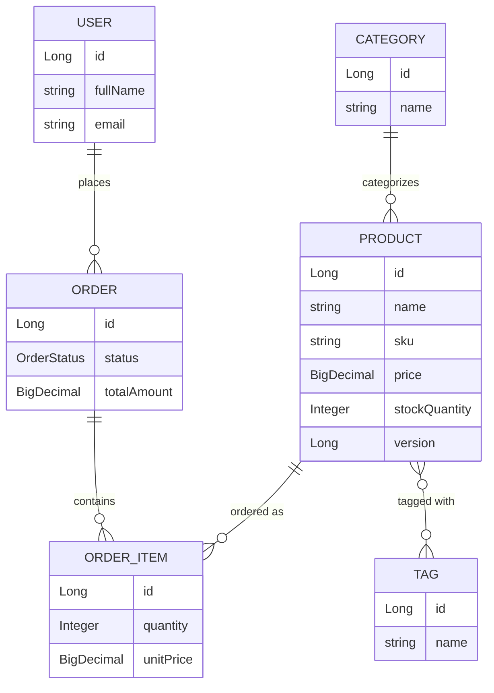

# E-Commerce / Inventory Management System

A REST API demonstrating clean layered architecture, JPA relationships, and
production-adjacent practices in Spring Boot. This is Project 1 of a 3-project
backend portfolio (Core REST API → Auth & Authorization → Production-grade
Booking/Order System).

**Status:** 🚧 Day 9 — Mockito unit tests for the service layer.
Integration tests and docs land over the following days (see
[Roadmap](#roadmap) below). To confirm the whole app works at this point,
not just today's feature, run the [Verification Checklist](#verification-checklist-run-this-to-confirm-the-whole-app-not-just-todays-feature).

## Tech Stack

- Java 17
- Spring Boot 3.3.4 (Web, Data JPA, Validation, Actuator)
- PostgreSQL 16
- Docker Compose (local Postgres)
- JUnit 5 / Mockito (service-layer unit tests) / Testcontainers (from Day 10)
- Maven

## Prerequisites

- JDK 17+
- Maven 3.9+
- Docker + Docker Compose

## Running Locally

**1. Start Postgres:**

```bash
docker-compose up -d
```

This starts Postgres on host port **5433** (not the default 5432), so it
won't conflict with a Postgres instance you may already have running
locally. Container name: `ecommerce_postgres`, database: `ecommerce_db`.

**2. Run the app:**

```bash
mvn spring-boot:run
```

The app starts on `http://localhost:8080` using the `dev` profile
(`application-dev.yml`), which points at `localhost:5433`.

**3. Verify it's connected:**

```bash
curl http://localhost:8080/actuator/health
```

You should see `"status":"UP"` with a `db` component also reporting `UP`.

On first startup, `DevDataSeeder` populates a small dataset (2 categories, 3
tags, 4 products, 2 users, 2 orders) so there's something to query
immediately. It's idempotent - it checks for existing data first, so
restarting the app won't duplicate rows.

**Peek at the seeded data (optional):**

```bash
docker exec -it ecommerce_postgres psql -U ecommerce_user -d ecommerce_db -c "SELECT name, sku, price, stock_quantity FROM products;"
```

**4. Run tests:**

```bash
mvn test
```

> Tests currently require Postgres to be running (step 1) since there's no
> Testcontainers wiring yet — that lands on Day 10 and removes this
> dependency for the integration test suite.

**5. Stop Postgres:**

```bash
docker-compose down
```

Add `-v` to also drop the data volume: `docker-compose down -v`

## Domain Model



Relationship types covered: one-to-many (`User→Order`, `Order→OrderItem`,
`Category→Product`) and many-to-many (`Product↔Tag`).

## API

Product CRUD is live end-to-end (Controller → Service → Repository, DTOs
only - the `Product` entity is never returned or accepted directly).

### Products

| Method | Path | Description |
|---|---|---|
| `POST` | `/api/products` | Create a product |
| `GET` | `/api/products` | List products (paginated) |
| `GET` | `/api/products/{id}` | Get one product |
| `GET` | `/api/products/search` | Dynamic, combinable filtering (name, category, price range, in-stock), paginated |
| `GET` | `/api/products/low-stock` | Products at or below a stock threshold |
| `PUT` | `/api/products/{id}` | Replace a product |
| `DELETE` | `/api/products/{id}` | Delete a product |

Requests are validated with Bean Validation, and every error - validation
failure, missing resource, malformed JSON, or anything unexpected - comes
back in the same shape via a global `@RestControllerAdvice`:

```json
{
  "timestamp": "2026-09-12T10:15:30.123Z",
  "status": 400,
  "error": "Bad Request",
  "message": "Validation failed",
  "path": "/api/products",
  "fieldErrors": {
    "price": "Price must be greater than zero",
    "sku": "SKU must contain only uppercase letters, digits, and single hyphens (e.g. ELEC-LAPTOP-001)"
  }
}
```

**Try it** (category id `1` is "Electronics" from the seed data):

```bash
curl -X POST http://localhost:8080/api/products \
  -H "Content-Type: application/json" \
  -d '{
        "name": "Mechanical Keyboard",
        "description": "Hot-swappable, 75% layout",
        "sku": "ELEC-KEYBOARD-001",
        "price": 129.00,
        "stockQuantity": 30,
        "categoryId": 1,
        "tagIds": []
      }'
```

```bash
curl http://localhost:8080/api/products
curl http://localhost:8080/api/products/1
```

`GET /api/products` is paginated - `page`, `size`, and `sort` are all query
params handled automatically by Spring Data (`sort` accepts
`field,direction`, e.g. `sort=price,desc`):

```bash
curl "http://localhost:8080/api/products?page=0&size=2&sort=price,desc"
```

```json
{
  "content": [ { "id": 1, "name": "14-inch Laptop", "price": 999.99, "...": "..." } ],
  "pageNumber": 0,
  "pageSize": 2,
  "totalElements": 5,
  "totalPages": 3,
  "last": false
}
```

**Dynamic filtering** - any subset of `name`, `categoryId`, `minPrice`,
`maxPrice`, `inStock` can be combined; omitted params simply aren't applied:

```bash
# electronics between $50-$500 that are in stock, cheapest first
curl "http://localhost:8080/api/products/search?categoryId=1&minPrice=50&maxPrice=500&inStock=true&sort=price,asc"

# case-insensitive name search on its own
curl "http://localhost:8080/api/products/search?name=laptop"
```

Low-stock products (default threshold `10`, override with `?threshold=`):

```bash
curl "http://localhost:8080/api/products/low-stock?threshold=30"
```

**See the error handling in action:**

```bash
# unknown product id -> 404
curl http://localhost:8080/api/products/999

# invalid payload -> 400 with fieldErrors
curl -X POST http://localhost:8080/api/products \
  -H "Content-Type: application/json" \
  -d '{"name": "", "sku": "bad sku!", "price": -5, "stockQuantity": -1, "categoryId": null}'
```

### Orders

| Method | Path | Description |
|---|---|---|
| `POST` | `/api/orders` | Place an order (decrements stock) |
| `GET` | `/api/orders` | List orders (paginated) |
| `GET` | `/api/orders/{id}` | Get one order |
| `GET` | `/api/orders/by-user/{email}` | An account's orders, paginated, newest first |
| `GET` | `/api/orders/search` | Orders for an email within a date range |
| `POST` | `/api/orders/{id}/confirm` | PENDING → CONFIRMED |
| `POST` | `/api/orders/{id}/cancel` | → CANCELLED, restocks items |

Placing an order resolves each `productId`, checks stock, decrements it, and
snapshots the current price into `unitPrice` on each line item - the whole
operation is one transaction, so a stock failure on item 3 of 5 rolls back
the decrements already made for items 1 and 2.

**Try it** (user id `1` is Alice, product id `1` is the seeded laptop):

```bash
curl -X POST http://localhost:8080/api/orders \
  -H "Content-Type: application/json" \
  -d '{
        "userId": 1,
        "items": [
          {"productId": 1, "quantity": 1},
          {"productId": 3, "quantity": 2}
        ]
      }'
```

```bash
curl http://localhost:8080/api/orders/1
curl -X POST http://localhost:8080/api/orders/1/confirm
curl -X POST http://localhost:8080/api/orders/1/cancel   # restocks both line items
```

Ordering more than the available stock returns a `409 Conflict`:

```bash
curl -i -X POST http://localhost:8080/api/orders \
  -H "Content-Type: application/json" \
  -d '{"userId": 1, "items": [{"productId": 1, "quantity": 9999}]}'
```

A user's order history, paginated, newest first:

```bash
curl "http://localhost:8080/api/orders/by-user/alice@example.com?page=0&size=5"
```

Orders for a user within a date range (ISO-8601 timestamps):

```bash
curl "http://localhost:8080/api/orders/search?email=alice@example.com&from=2026-01-01T00:00:00Z&to=2026-12-31T23:59:59Z"
```

## Verification Checklist (run this to confirm the whole app, not just today's feature)

This section is cumulative and updated every day - it's meant to prove the
*entire* app works end-to-end at its current state, not just whatever
landed most recently. Run top to bottom after starting Postgres and the app
(see [Running Locally](#running-locally)); every step includes what a
correct result looks like so a failure is obvious.

**0. Preconditions**

```bash
docker-compose up -d
mvn spring-boot:run &      # or run it in its own terminal
sleep 5
curl http://localhost:8080/actuator/health
```
Expect: `{"status":"UP", ...}` with a `db` component also `UP`. If this
fails, nothing below will work - check `docker-compose ps` first.

**1. Seed data is present** (2 categories, 3 tags, 4 products, 2 users, 2 orders)

```bash
curl -s http://localhost:8080/api/products | python3 -m json.tool | grep totalElements
```
Expect: `"totalElements": 4` (before you add anything below).

**2. Product CRUD** (Day 4/5)

```bash
# create -> 201 with Location header and a body containing the new id
curl -i -X POST http://localhost:8080/api/products \
  -H "Content-Type: application/json" \
  -d '{"name":"Mechanical Keyboard","sku":"ELEC-KEYBOARD-001","price":129.00,"stockQuantity":30,"categoryId":1,"tagIds":[]}'

# read it back by id -> 200, same data
curl http://localhost:8080/api/products/5

# validation failure -> 400 with fieldErrors (Day 5)
curl -i -X POST http://localhost:8080/api/products \
  -H "Content-Type: application/json" \
  -d '{"name":"","sku":"bad sku!","price":-5,"stockQuantity":-1,"categoryId":null}'

# not found -> 404
curl -i http://localhost:8080/api/products/999

# update -> 200 with changed fields
curl -i -X PUT http://localhost:8080/api/products/5 \
  -H "Content-Type: application/json" \
  -d '{"name":"Mechanical Keyboard v2","sku":"ELEC-KEYBOARD-001","price":139.00,"stockQuantity":25,"categoryId":1,"tagIds":[]}'

# delete -> 204, then a re-read -> 404
curl -i -X DELETE http://localhost:8080/api/products/5
curl -i http://localhost:8080/api/products/5
```

**3. Pagination and sorting** (Day 7)

```bash
curl -s "http://localhost:8080/api/products?page=0&size=2&sort=price,desc" | python3 -m json.tool
```
Expect: `content` has 2 items, ordered by price descending; `pageSize: 2`.

**4. Low-stock query** (Day 7)

```bash
curl -s "http://localhost:8080/api/products/low-stock?threshold=30" | python3 -m json.tool
```
Expect: only products with `stockQuantity <= 30`, ordered ascending by stock.

**5. Dynamic filtering / Specifications** (Day 8)

```bash
# combined filters
curl -s "http://localhost:8080/api/products/search?categoryId=1&minPrice=50&maxPrice=500&inStock=true" | python3 -m json.tool

# name filter alone
curl -s "http://localhost:8080/api/products/search?name=laptop" | python3 -m json.tool

# no filters at all -> behaves like plain GET /api/products
curl -s "http://localhost:8080/api/products/search" | python3 -m json.tool
```
Expect: each call returns only products matching the supplied filters;
omitted filters don't narrow the result at all; the no-filter call returns
everything (paginated).

**6. Order creation, stock decrement, transactional rollback** (Day 6)

```bash
# happy path -> 201, totalAmount computed, stock decremented on the products used
curl -i -X POST http://localhost:8080/api/orders \
  -H "Content-Type: application/json" \
  -d '{"userId":1,"items":[{"productId":1,"quantity":1},{"productId":3,"quantity":2}]}'

# insufficient stock -> 409, and confirm nothing was partially decremented
curl -i -X POST http://localhost:8080/api/orders \
  -H "Content-Type: application/json" \
  -d '{"userId":1,"items":[{"productId":1,"quantity":9999}]}'
curl http://localhost:8080/api/products/1   # stockQuantity unchanged by the failed attempt
```

**7. Order state transitions** (Day 6)

```bash
curl -i -X POST http://localhost:8080/api/orders/3/confirm   # PENDING -> CONFIRMED, 200
curl -i -X POST http://localhost:8080/api/orders/3/cancel    # -> CANCELLED, 200, restocks items
curl -i -X POST http://localhost:8080/api/orders/3/cancel    # already cancelled -> 409
```

**8. Order queries** (Day 7)

```bash
curl -s "http://localhost:8080/api/orders/by-user/alice@example.com?page=0&size=5" | python3 -m json.tool
curl -s "http://localhost:8080/api/orders/search?email=alice@example.com&from=2026-01-01T00:00:00Z&to=2026-12-31T23:59:59Z" | python3 -m json.tool
```
Expect: only Alice's orders, newest first for #8's first call; only orders
inside the date range for the second.

**9. Automated tests** (Day 9)

```bash
mvn test
```
Expect: `Tests run: <N>, Failures: 0, Errors: 0` and `BUILD SUCCESS`. As of
Day 9 this runs:

- `ProductServiceImplTest` - `create` (happy path with no tags, happy path
  resolving multiple tags, category-not-found, one-tag-missing-fails-the-
  whole-request), `getById` (found / not-found), `getAll` and `search`
  (verifying the repository call is delegated to with the right
  `Pageable`/`Specification`), `getLowStock`, `update` (happy path /
  product-not-found), `delete` (happy path / not-found - never calls
  `deleteById` when the product doesn't exist).
- `OrderServiceImplTest` - `create` (happy path asserting the exact
  computed total and per-product stock decrement, user-not-found,
  product-not-found, **insufficient stock** with the exact requested/
  available numbers in the message, and a case confirming a later item's
  stock failure still leaves `save()` uncalled), `confirm` (PENDING ->
  CONFIRMED happy path / rejecting a non-PENDING order), `cancel` (happy
  path asserting stock is restored per item / rejecting an already-
  cancelled order without double-restocking), `getByUserEmailAndDateRange`
  delegation.
- `SkuFormatValidatorTest` - the Day 5 custom `@ValidSku` regex, parameterized
  over well-formed SKUs, several malformed shapes (lowercase, spaces, double
  hyphen, leading/trailing hyphen, underscore, punctuation), and blank/null
  input (valid here on purpose - presence is `@NotBlank`'s job, not this
  validator's).

All of the above are pure Mockito unit tests - repositories and mappers are
mocked, nothing touches a real database. That's deliberate: it's what makes
these fast enough to run on every change, and it's exactly why Day 10 adds a
*separate* Testcontainers integration suite against a real Postgres, to
catch what mocking can't (real cascades, real constraint violations, real
transactional rollback under an actual insufficient-stock failure).

---

## Configuration

| Variable | Where | Default |
|---|---|---|
| App port | `application-dev.yml` | `8080` |
| Postgres host port | `docker-compose.yml` | `5433` |
| DB name | `docker-compose.yml` | `ecommerce_db` |
| DB user / password | `docker-compose.yml` | `ecommerce_user` / `ecommerce_pass` |

## Roadmap

- [x] **Day 1** — Project bootstrap, Postgres via Docker Compose, health check
- [x] **Day 2** — Core JPA entities and relationships
- [x] **Day 3** — Repositories and seed data
- [x] **Day 4** — Product CRUD (Controller → Service → Repository, DTOs)
- [x] **Day 5** — Validation and global exception handling
- [x] **Day 6** — Order creation business logic
- [x] **Day 7** — Custom queries, pagination, sorting
- [x] **Day 8** — Dynamic filtering with JPA Specifications
- [x] **Day 9** — Unit tests (JUnit5 + Mockito)
- [ ] **Day 10** — Integration tests (Testcontainers)
- [ ] **Day 11** — OpenAPI / Swagger docs
- [ ] **Day 12** — Edge cases and structured logging
- [ ] **Day 13** — Architecture diagram + full README
- [ ] **Day 14** — Refactor pass
- [ ] **Day 15** — Final polish, `v1.0` tag

## Design Decisions

- **Constructed services with `new ProductServiceImpl(...)` in test `setUp()`
  instead of `@InjectMocks`:** both work here since the constructor is a
  simple `@RequiredArgsConstructor` over the mocked fields, but being
  explicit means a future field reorder or an added constructor param fails
  loudly at compile time instead of silently leaving a mock unwired.
- **`search()`'s unit test asserts `findAll(any(Specification.class), eq(pageable))`
  rather than inspecting the Specification's predicate:** a `Specification`
  is a lambda; there's no clean way to assert "this lambda filters by name"
  without actually running it against data, which is what
  `ProductSpecification.fromCriteria(...)`'s own correctness depends on
  Hibernate to evaluate. Asserting *that a Specification was passed through
  to the repository* is the right-sized claim for a mocked-repository unit
  test; whether the generated SQL actually filters correctly is verified for
  real once Day 10's Testcontainers suite runs it against Postgres.
- **Insufficient-stock rollback is asserted differently at the unit vs.
  integration level:** `OrderServiceImplTest` can only prove "the exception
  is thrown and `save()` is never called" - with mocked repositories there's
  no real transaction, so there's nothing to actually roll back. Whether an
  in-progress stock decrement on an *earlier* item in the same request
  really reverts in the database when a *later* item fails is a claim only
  a real transactional test against real Postgres can make - that's what
  Day 10 adds.
- **Postgres on a non-default port (5433):** avoids clashing with a local
  Postgres install on the default 5432, without needing per-developer config
  overrides.
- **`ddl-auto: update` for now:** fine for early development; will be
  reconsidered (likely Flyway/Liquibase) as the schema stabilizes.
- **Actuator included from Day 1:** gives an immediate, honest way to verify
  DB connectivity rather than eyeballing console logs.
- **`BaseEntity` with id-only `equals`/`hashCode`:** shared across all
  entities via `@MappedSuperclass`. Basing equality only on `id` (via
  Lombok's `@EqualsAndHashCode.Include`) avoids two classic JPA foot-guns:
  pulling lazy-loaded relationship fields into equality checks, and infinite
  recursion on bidirectional relationships.
- **`OrderItem.unitPrice` is a snapshot, not a live read of `Product.price`:**
  if a product's price changes later, past orders should still reflect what
  the customer actually paid.
- **`Product.version` (optimistic locking) added now, used later:** costs
  nothing to add today and avoids a schema migration when Project 3 actually
  exercises it under concurrent stock updates.
- **`Order.addItem()`/`removeItem()` helper methods:** keep both sides of the
  bidirectional `Order ↔ OrderItem` relationship in sync in one place, rather
  than relying on every call site to remember to set both ends.
- **`Product ↔ Tag` many-to-many:** the one many-to-many relationship in the
  domain, kept deliberately simple (just a name) so the focus stays on the
  relationship mechanics rather than the domain concept.
- **`DevDataSeeder` guarded by profile + row count:** using a
  `CommandLineRunner` instead of `data.sql` because it exercises the actual
  entity relationships (via `Order.addItem()`) rather than hand-written
  insert statements that could drift from the schema. Restricted to the
  `dev` profile and made idempotent so it's safe to leave running.
- **Hand-written `ProductMapper` over MapStruct/ModelMapper:** the
  entity↔DTO mapping is simple enough that a generated mapper wouldn't save
  much, and an explicit mapper keeps the boundary readable in one place.
- **Service returns DTOs, never entities:** `ProductService` methods return
  `ProductResponseDto`, not `Product`. The controller never touches the
  entity at all, which is what actually enforces "don't leak JPA entities
  over the wire" rather than just conventionally avoiding it.
- **`ResourceNotFoundException` introduced before its handler:** the service
  layer's contract (throw when something's missing) was written correctly
  from Day 4, even though the `@ControllerAdvice` that turns it into a 404
  didn't land until Day 5.
- **Custom `@ValidSku` validator instead of a bare `@Pattern`:** a
  `@Pattern`-only approach would give a generic "must match regex" message
  when it fails. A custom `ConstraintValidator` lets the error message
  explain the actual convention (uppercase, digits, hyphens) instead - the
  kind of thing that matters when this is the message a teammate sees.
  It also deliberately treats blank values as valid, leaving "is it present
  at all" to `@NotBlank`, so the two annotations report distinct problems
  instead of one confusing combined one.
- **One `GlobalExceptionHandler`, one `ErrorResponse` shape:** every error
  path - validation failure, missing resource, malformed JSON, unexpected
  exception - returns the same JSON shape. A client only needs to learn one
  error format, and `fieldErrors` is omitted from the JSON entirely (via
  `@JsonInclude(NON_NULL)`) when there isn't any, rather than showing up as
  `null`.
- **Unexpected exceptions are logged server-side before being masked from
  the client:** the `Exception.class` fallback handler logs the full stack
  trace but returns a generic "unexpected error" message - enough detail to
  debug from the logs, without leaking internals to the API consumer.
- **`OrderService.create()` is one transaction covering every line item:**
  stock is decremented per item as the loop runs, using plain setters on
  managed entities rather than explicit `save()` calls (JPA's dirty checking
  flushes them at commit). If any item fails - unknown product, insufficient
  stock - the whole transaction rolls back, including stock already
  decremented for earlier items in the same request. Partial orders aren't a
  safe thing to expose as an API.
- **`InsufficientStockException` / `InvalidOrderStateException` → 409, not
  400 or 404:** both describe a well-formed request that can't be satisfied
  right now (not enough stock; wrong order status for this transition) -
  semantically a conflict with current state, distinct from bad input or a
  missing resource.
- **`cancel()` restocks; `confirm()` doesn't touch stock:** cancelling an
  order releases the inventory it reserved, so it's allowed from `PENDING`
  or `CONFIRMED` but not from `CANCELLED` again (would double-restock).
  Confirming is a pure status transition since stock was already reserved
  at order creation time.
- **`PageResponse<T>` instead of returning `Page<T>` directly:** Spring
  Data's own docs warn against serializing `PageImpl` as-is - it isn't
  designed as a stable wire format. Wrapping it keeps the JSON shape
  (`content`, `pageNumber`, `pageSize`, `totalElements`, `totalPages`,
  `last`) something this project controls.
- **`SELECT DISTINCT` on the order date-range query:** fetch-joining a
  collection (`o.items`) returns one row per (order, item) pair, so without
  `DISTINCT` an order with 3 items would show up 3 times in the result list.
  This only affects collection fetch joins - the `ManyToOne` fetch join in
  `findLowStock` doesn't have the problem, since a to-one join can't
  multiply rows.
- **`ProductSpecification` methods return a `null` predicate when their own
  filter is absent, instead of branching in the service layer:** Spring
  Data's `Specification.and(...)` composition treats a `null` predicate as
  a no-op and drops it from the final query. That's what makes the filters
  genuinely combinable - `/products/search` with zero params degrades to
  "match everything," and any subset of `name`/`categoryId`/`minPrice`/
  `maxPrice`/`inStock` combines without an `if` per filter or a combinatorial
  explosion of hand-written queries.
- **`@Query` used where a derived method name would get awkward:** simple
  lookups (`findByEmail`, `findBySku`) stay as derived queries - they're
  clearer as method names than as JPQL. The date-range order query and the
  low-stock product query switch to `@Query` because they need fetch joins
  and ordering control that a method name can't express cleanly.
